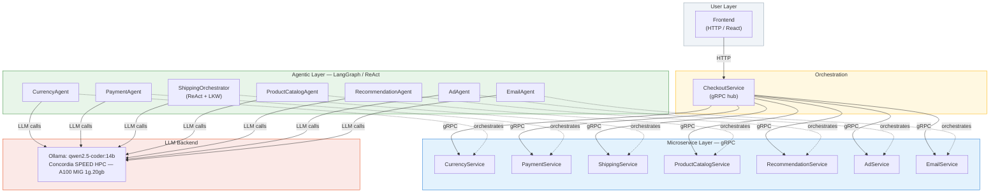
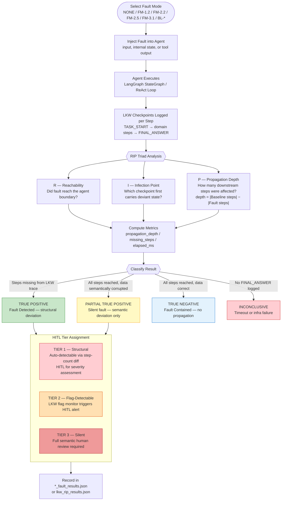
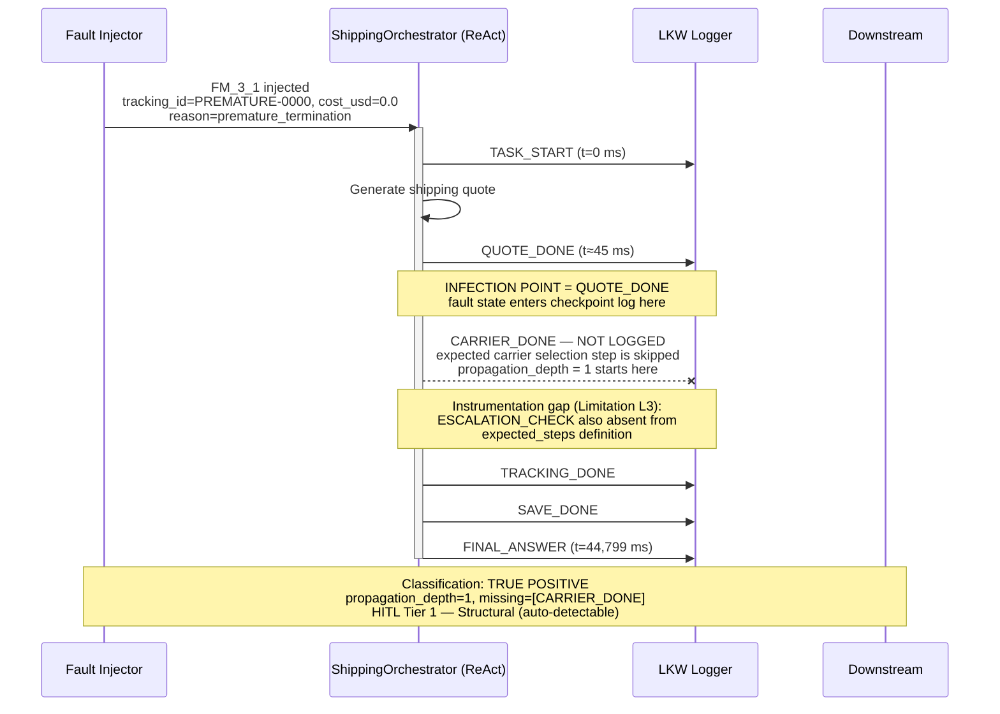
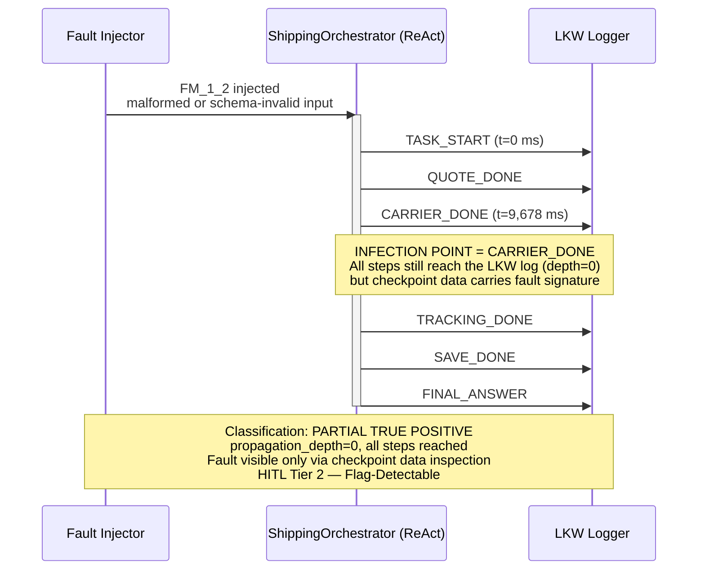
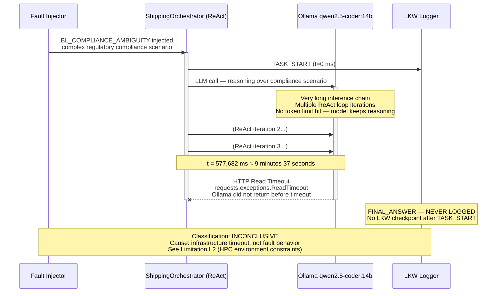
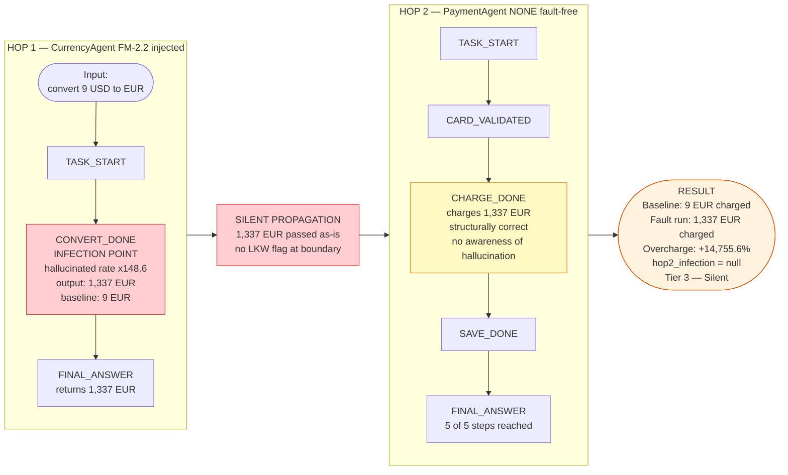
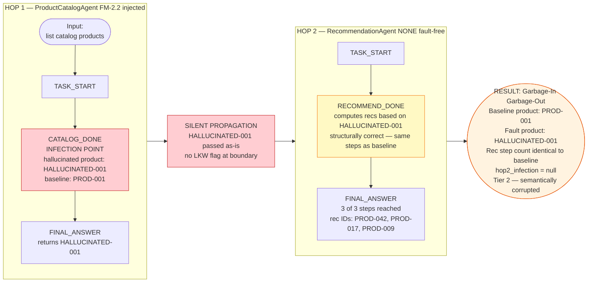
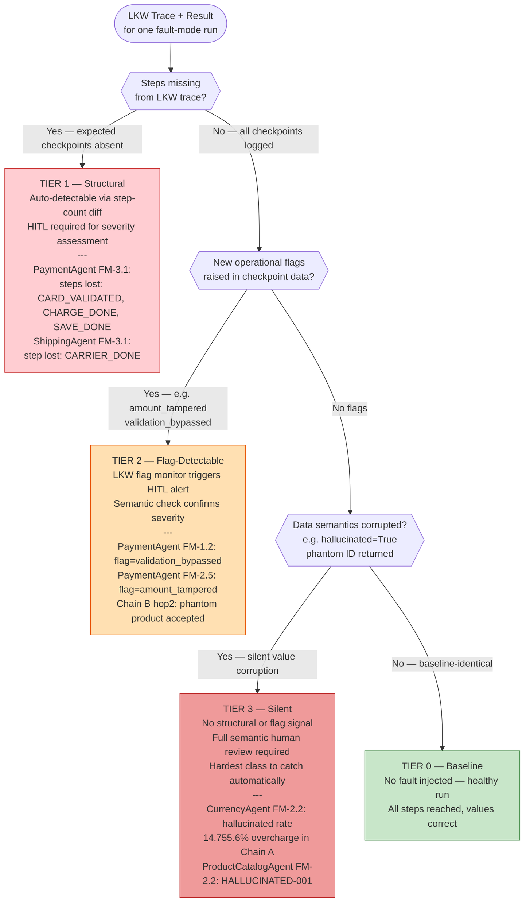

# LLM-MAS Research Diagrams Report

**Project:** Failure Injection and Propagation Analysis in Agentic Microservice Workflows  
**Author:** Deepak Sunil Chavan, Concordia University  
**Branch:** `deepak/fault-injection`  
**Date:** 2026-06-28  
**Data sources:** `src/shippingservice/lkw_rip_results.json`, `src/results/cross_agent_propagation.json`, `src/results/hitl_classification_report.json`

> All numeric annotations in this report are sourced directly from the JSON result files.
> All Mermaid diagrams render natively on GitHub. For Overleaf, see `paper_updated.tex` for embedded TikZ versions.

---

## Table of Contents

| # | Diagram | Paper Section |
|---|---|---|
| 1 | [Master System Architecture](#1-master-system-architecture) | Section II — System and Fault Model |
| 2 | [LKW/RIP Methodology Pipeline](#2-lkwrip-methodology-pipeline) | Section III — Failure Injection Workflow |
| 3 | [ShippingService FM-3.1 Failure Trace](#3-shippingservice-fm-31-failure-trace) | Section V — Retail Bench Results |
| 4 | [ShippingService FM-1.2 Failure Trace](#4-shippingservice-fm-12-failure-trace) | Section V — Retail Bench Results |
| 5 | [BL_COMPLIANCE_AMBIGUITY — INCONCLUSIVE Timeline](#5-bl_compliance_ambiguity--inconclusive-timeline) | Section V — Retail Bench Results |
| 6 | [Cross-Agent Chain A — Currency → Payment](#6-cross-agent-chain-a--currency--payment) | Section VII — Cross-Agent Propagation |
| 7 | [Cross-Agent Chain B — ProductCatalog → Recommendation](#7-cross-agent-chain-b--productcatalog--recommendation) | Section VII — Cross-Agent Propagation |
| 8 | [HITL Tier Classification Decision Tree](#8-hitl-tier-classification-decision-tree) | Section VIII — HITL Framework |

---

## 1. Master System Architecture

**Purpose:** Shows the full LLM-MAS topology — gRPC service connections, agent wrapper layers, and the shared Ollama LLM backend.

**Key facts:**
- 7 microservices connected to `CheckoutService` via gRPC
- 7 agent wrappers (LangGraph/ReAct) each orchestrating one service
- Single shared Ollama backend (qwen2.5-coder:14b, Concordia SPEED HPC A100 MIG)
- Frontend communicates with CheckoutService over HTTP



> **Data source:** `src/protos/demo.proto` (gRPC definitions), `src/shippingservice/orchestrator.py` (ReAct), `src/*agent*/` (LangGraph agents)

---

## 2. LKW/RIP Methodology Pipeline

**Purpose:** Shows the complete testing pipeline from fault injection through RIP analysis to HITL tier classification. This is the core methodological contribution.



> **Data source:** `src/shippingservice/lkw_rip_runner.py`, `src/hitl_detector.py`, `src/stability_analysis.py`

---

## 3. ShippingService FM-3.1 Failure Trace

**Fault:** FM-3.1 — Premature Termination  
**Result:** TRUE POSITIVE — fault structurally detected  
**Key metrics** (from `lkw_rip_results.json`):

| Field | Value |
|---|---|
| `infection_point` | `QUOTE_DONE` |
| `propagation_depth` | 1 |
| `missing_steps` | `[CARRIER_DONE]` |
| `elapsed_ms` | 44,799 ms |
| `tracking_id` | `PREMATURE-0000` |
| `cost_usd` | 0.0 |



---

## 4. ShippingService FM-1.2 Failure Trace

**Fault:** FM-1.2 — Incorrect Task Decomposition (malformed/schema-invalid input)  
**Result:** PARTIAL TRUE POSITIVE — all steps reached but fault detectable at CARRIER_DONE  
**Key metrics** (from `lkw_rip_results.json`):

| Field | Value |
|---|---|
| `infection_point` | `CARRIER_DONE` |
| `propagation_depth` | 0 |
| `missing_steps` | `[]` |
| `elapsed_ms` | 9,678 ms |



---

## 5. BL_COMPLIANCE_AMBIGUITY — INCONCLUSIVE Timeline

**Fault:** BL_COMPLIANCE_AMBIGUITY — complex regulatory compliance scenario  
**Result:** INCONCLUSIVE — HTTP read timeout, agent never returned FINAL_ANSWER  
**Key metrics** (from `lkw_rip_results.json`):

| Field | Value |
|---|---|
| `elapsed_ms` | 577,682 ms (≈ 9 min 37 sec) |
| `error` | `requests.exceptions.ReadTimeout` (Ollama timeout) |
| `FINAL_ANSWER` | Never logged |



---

## 6. Cross-Agent Chain A — Currency → Payment

**Experiment:** CurrencyAgent injected with FM-2.2 (hallucinated output); PaymentAgent runs baseline (NONE).  
**Finding:** Hallucinated exchange rate propagates silently across the agent boundary with no LKW structural signal at hop 2.  
**Key metrics** (from `cross_agent_propagation.json`):

| Field | Value |
|---|---|
| `hop1_infection` | `CONVERT_DONE` |
| `baseline_units` | 9 EUR |
| `propagated_units` | 1,337 EUR |
| `overcharge_eur` | 1,328 EUR |
| `overcharge_pct` | **14,755.6%** |
| `hop2_infection` | `null` (no signal at PaymentAgent) |
| `hop2_steps_lost` | 0 of 5 |



---

## 7. Cross-Agent Chain B — ProductCatalog → Recommendation

**Experiment:** ProductCatalogAgent injected with FM-2.2 (phantom product ID); RecommendationAgent runs baseline (NONE).  
**Finding:** Phantom product propagates silently — recommendation steps structurally identical to baseline but semantically corrupted (garbage-in, garbage-out).  
**Key metrics** (from `cross_agent_propagation.json`):

| Field | Value |
|---|---|
| `hop1_infection` | `CATALOG_DONE` |
| `baseline_product_ids` | `[PROD-001]` |
| `propagated_product_ids` | `[HALLUCINATED-001]` |
| `baseline_recs` | `[PROD-042, PROD-017, PROD-009]` |
| `propagated_recs` | `[PROD-042, PROD-017, PROD-009]` (structurally identical) |
| `hop2_infection` | `null` (no structural signal) |
| `hop2_steps_lost` | 0 of 3 |



---

## 8. HITL Tier Classification Decision Tree

**Purpose:** Shows how LKW checkpoint evidence maps to HITL tier assignments for automated intervention routing.  
**Data source:** `src/results/hitl_classification_report.json`



**Tier assignment summary** (PaymentAgent sample from `hitl_classification_report.json`):

| Fault Mode | Tier | Label | Auto-Detect | HITL Required | Infection Point |
|---|---|---|---|---|---|
| NONE | 0 | BASELINE | yes | no | — |
| FM_3_1 | 1 | Structural | yes | yes | `FINAL_ANSWER` |
| FM_1_2 | 2 | Flag-Detectable | no | yes | `CARD_VALIDATED` |
| FM_2_5 | 2 | Flag-Detectable | no | yes | `CARD_VALIDATED` |
| FM_2_2 | 3 | Silent | no | yes | `CHARGE_DONE` |

---

## Summary Findings Table

| Diagram | Key Finding | Numeric Evidence | Data Source |
|---|---|---|---|
| 1. System Architecture | 7 agentic microservices, single shared LLM, gRPC backbone | 7 agents, 7 services | `src/protos/demo.proto` |
| 2. LKW/RIP Methodology | RIP triad → 4 result classes → 3 HITL tiers | 11 ShippingService runs, 6×9 deterministic runs | `src/hitl_detector.py` |
| 3. FM-3.1 Trace | TRUE POSITIVE: early catch, infection at QUOTE_DONE | propagation_depth=1, 44,799 ms | `lkw_rip_results.json` |
| 4. FM-1.2 Trace | PARTIAL TP: all steps logged, infection at CARRIER_DONE | propagation_depth=0, 9,678 ms | `lkw_rip_results.json` |
| 5. BL_COMPLIANCE Timeout | INCONCLUSIVE: LLM never returned FINAL_ANSWER | 577,682 ms timeout | `lkw_rip_results.json` |
| 6. Chain A (Currency→Payment) | Silent 14,755.6% financial overcharge across agent boundary | 9 EUR → 1,337 EUR overcharge | `cross_agent_propagation.json` |
| 7. Chain B (Product→Rec) | Silent phantom product propagation, garbage-in/garbage-out | HALLUCINATED-001 passed undetected | `cross_agent_propagation.json` |
| 8. HITL Tier Decision Tree | Tier 1 (structural/auto) → Tier 2 (flag) → Tier 3 (silent/semantic) | 5 tiers mapped per agent | `hitl_classification_report.json` |

---

## How to Use These Diagrams

### Share via GitHub permalink
This file renders natively on GitHub with all Mermaid diagrams.  
**Share this link with your professor:**
```
https://github.com/<org>/LLM-MAS/blob/main/src/results/diagrams_report.md
```
(Replace `<org>` with the actual GitHub org/username for the public remote.)

### Overleaf / LaTeX
TikZ versions of Diagrams 1 and 6+7 are embedded directly in `paper_updated.tex`:
- `fig:architecture` — System Architecture (Section II)
- `fig:cross-agent` — Cross-Agent Chain A + B (Section VII)

Compile `paper_updated.tex` in Overleaf to get publication-ready PDF figures.

### draw.io / diagrams.net
1. Open [app.diagrams.net](https://app.diagrams.net)
2. **Extras → Edit Diagram** → paste any Mermaid block above
3. Export as PNG or SVG for slides and reports

### Mermaid Live Editor
1. Open [mermaid.live](https://mermaid.live)
2. Paste any Mermaid block → export as SVG
3. Upload SVG to Overleaf → `\includegraphics[width=\columnwidth]{filename.svg}`
