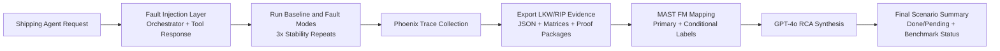

# Failure Injection and Analysis Workflow (ShippingService)

Current workflow:

Shipping Agent -> Fault Injection at Orchestrator/Tool-Response Layer -> Phoenix Trace Collection -> Trace Export (LKW/RIP) -> MAST Annotation -> GPT-4o Evaluation -> RCA and Stability Matrix

Notes:
- Injection is aligned to structured JSON orchestration, not user-text adversarial prompting.
- Primary FM label is set by dominant reproducible behavior; secondary labels are conditional on explicit trace evidence.
